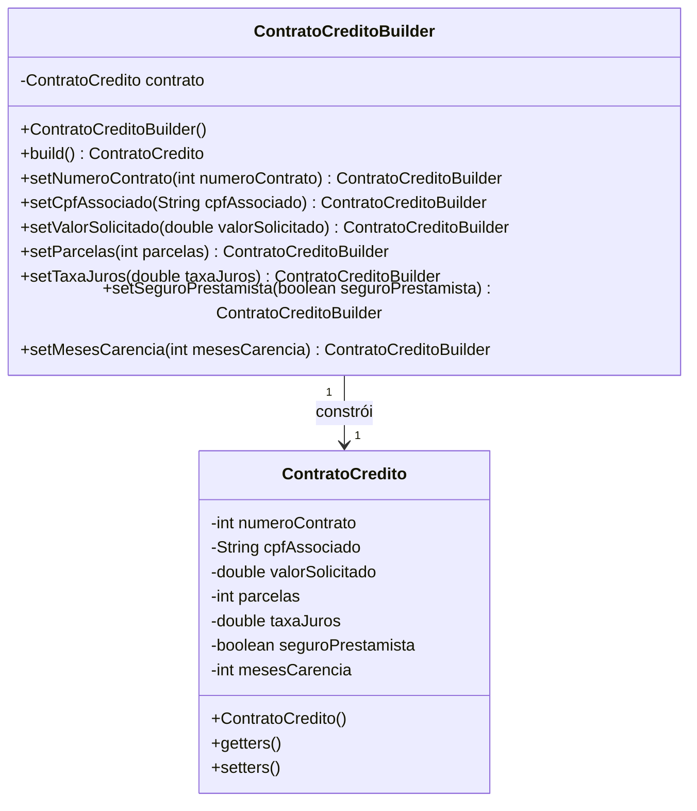

diagrama:

```mermaid
classDiagram
    class ContratoCredito {
        -int numeroContrato
        -String cpfAssociado
        -double valorSolicitado
        -int parcelas
        -double taxaJuros
        -boolean seguroPrestamista
        -int mesesCarencia
        +ContratoCredito()
        +getters()
        +setters()
    }

    class ContratoCreditoBuilder {
        -ContratoCredito contrato
        +ContratoCreditoBuilder()
        +build() ContratoCredito
        +setNumeroContrato(int numeroContrato) ContratoCreditoBuilder
        +setCpfAssociado(String cpfAssociado) ContratoCreditoBuilder
        +setValorSolicitado(double valorSolicitado) ContratoCreditoBuilder
        +setParcelas(int parcelas) ContratoCreditoBuilder
        +setTaxaJuros(double taxaJuros) ContratoCreditoBuilder
        +setSeguroPrestamista(boolean seguroPrestamista) ContratoCreditoBuilder
        +setMesesCarencia(int mesesCarencia) ContratoCreditoBuilder
    }

    ContratoCreditoBuilder "1" --> "1" ContratoCredito : constrói
```
